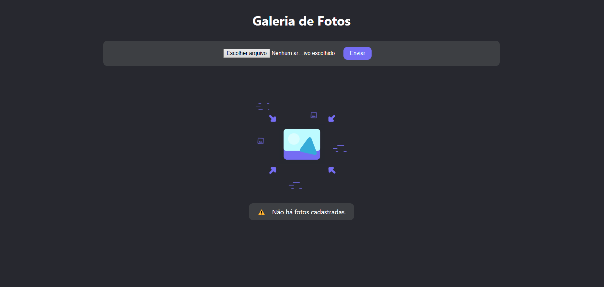
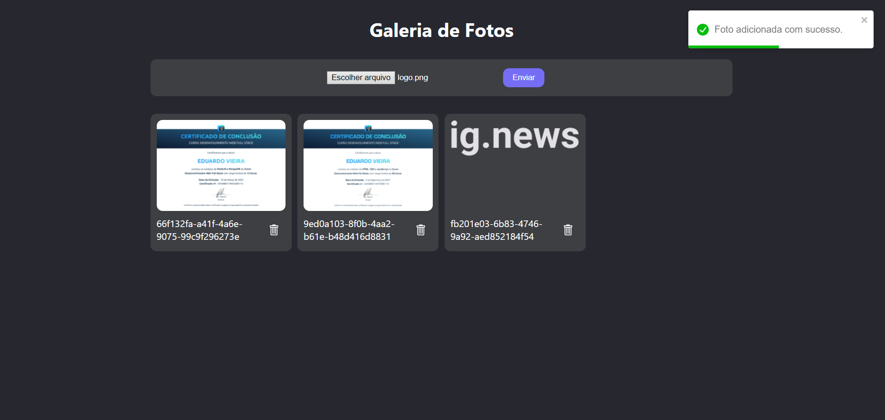

<h1 align="center" >Galeria de Fotos - Firebase</h1>

Aplicação de galeria de fotos que armazena imagens enviadas do tipo png, jpg e jpeg no Firebase e exibe na tela de forma responsiva para qualquer dispositivo.
<p>Foi feita com intuito de praticar as tecnologias, a partir das aulas do professor Bonieky, utilizando React, Typescript, Styled Components, Firebase.</p>
<p>Fui além do projeto desenvolvido e adicionei:</p>

* Animações JSON utilizando o Lottie.
* `Responsividade` para qualquer dispositivo.
* Tratamento de erros e sucessos com `toast`.
* Opção de remover alguma foto acessando o firebase.
* Deploy na Netlify:

https://sorrentinogaleria.netlify.app

## Execução do projeto:

Para rodar o projeto, primeiro é necessário clonar o repositório e abrir em uma IDE, VSCode por exemplo.

```bash
# Clonar repositório
$ git clone https://github.com/Edusorrentino10/gallery.git
# Acessar pasta do projeto clonado
$ cd gallery

# Instalar dependências
$ npm install

# Executar aplicação
$ npm start

# Abrir aplicação na porta 3000, acessando: http://localhost:3000
```

<h2 align="center"></h2>
<h2 align="center"></h2>


Feito por <a href="https://github.com/Edusorrentino10">Eduardo Sorrentino</a>.

Linkedin: https://linkedin.com/in/eduardo-sorrentino/